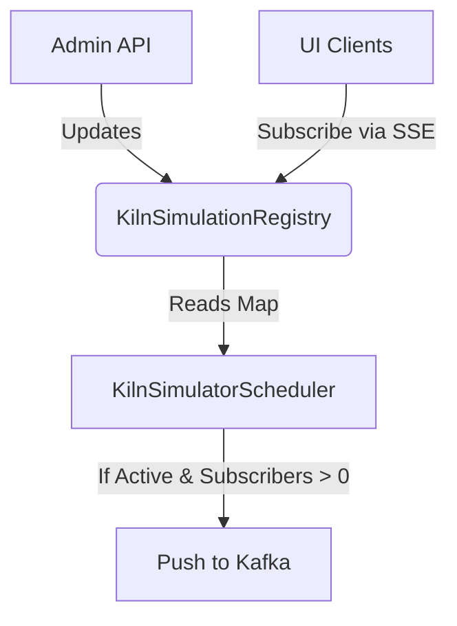

# Kiln Management Architecture

## 1. System Overview
The Kiln Simulator system has evolved from a hardcoded simulation loop into a dynamic, multi-tenant capable entity model. This architecture allows administrators to manage industrial kilns via a centralized UI, giving granular control over operational thresholds, random volatility, and anomaly generation.

## 2. Real-Time Telemetry (Server-Sent Events)
The system utilizes Server-Sent Events (SSE) instead of WebSockets. SSE provides a lightweight, unidirectional pipeline perfectly suited for high-frequency telemetry data (`text/event-stream`).

To solve the challenge of an administrator modifying a Kiln's configuration while a user is actively monitoring it, the SSE stream **multiplexes** events.

```javascript
// Client-side implementation concept
const sse = new EventSource('/api/kilns/5/stream');

// Standard telemetry pipeline
sse.addEventListener('telemetry', (e) => updateChart(JSON.parse(e.data)));

// Administrative override pipeline
sse.addEventListener('config_updated', (e) => updateHeaderAndThresholds(JSON.parse(e.data)));
```

*   **Benefit:** The UI remains entirely reactive without ever needing to explicitly poll the database for name changes or threshold updates.

## 3. Data Model & Math Constraints

To ensure data integrity, the `Normal` baseline probability is never persisted. We only store the anomaly vectors (`warning` and `critical`), and the system implicitly infers the baseline.

### The Entity Concept
```text
┌─────────────────────────────────────┐
│               KILN                  │
├─────────────────────────────────────┤
│ id: UUID (PK)                       │
│ name: String                        │
│ type: Enum                          │
│ is_active: Boolean                  │
│ baseline_temp: Double               │
│ warning_temp: Double                │
│ critical_temp: Double               │
│ state_duration_seconds: Integer (N) │
│ warning_probability: Double         │
│ critical_probability: Double        │
└─────────────────────────────────────┘
```

### Validation 
It is a fundamental rule of relational mapping that calculable remainders should not be stored. The `Normal` state probability is calculated dynamically: `1.0 - (warningProbability + criticalProbability)`. 

*   **Constraint:** The `KilnService` restricts any REST payload where `warning + critical > 1.0`. All illegal payloads are rejected with a `400 Bad Request`.

## 4. Simulator Engine & Caching

Querying the database every 2 seconds for a simulation tick will inevitably bottleneck. Instead, the `@Scheduled` method iterates over an in-memory `ConcurrentHashMap`.

### `KilnSimulationRegistry`
The application maintains a centralized `@Service` registry tracking active kilns and their real-time client subscriber counts. 



1.  **On Startup:** Active kilns are loaded from the database into the Registry.
2.  **Admin Changes:** When an admin saves a Kiln, the API updates the DB and immediately synchronizes the `KilnSimulationRegistry`.
3.  **Client Subscriptions:** When a UI client connects, the SSE handler increments the specific Kiln's `subscriber_count`. It decrements instantly on socket closure.
4.  **The Simulator Loop:** The `KilnSimulatorScheduler` simply iterates over the HashMap. **Zero Database Queries are executed in the high-frequency loop.**
