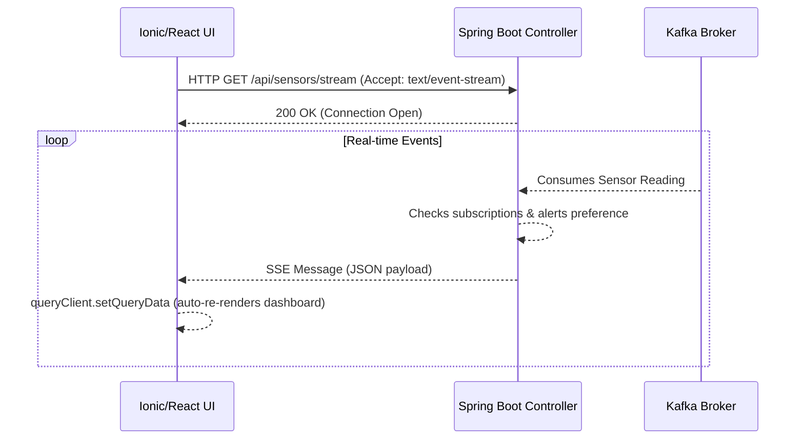

# Design: SSE Real-Time Telemetry Dashboard

## Architecture Overview

### Backend Pipeline (Spring Boot)
1. **Sensor Readings Flow**: Sensors (or the newly designed `KilnSimulator` `@Scheduled` cron job) send payloads to `AssetSensorReadingController` which publishes a reading payload to a predefined Kafka topic.
2. **Kafka Listener**: An internal consumer connects to this topic and processes real-time events.
3. **SSE Connection Manager**: Exposes an SSE endpoint serving connected clients.
   - When a connection drops due to client timeout, it uses an internal `SseEmitter` timeout listener to aggressively clean up dangling references.
4. **Broadcast Mechanism**: Kafka readings fan out to active user references tracked via an in-memory `ConcurrentHashMap`.

### Web UI Interface
The web client shifts to a TanStack Query model with React.
1. `useQuery` fetches historical list of anomalies.
2. Local user preferences govern whether they subscribe to continuous stats or strictly anomalies using `Zustand`.
3. The custom `useMonitoring(kilnId)` instantiates a native browser `EventSource()`. It actively tracks connection lineage, handling drops during mobile context switches (WiFi -> Cellular) by exposing `Empty`, `Loading`, `Connected`, and `Reconnecting` states robustly.
4. The hook mutates TanStack's cache directly using `queryClient.setQueryData()` upon receiving a valid JSON parsed `message` event.
5. Has the option to switch from dark mode to light mode.

## Sequence Diagrams

## Security Constraints
Because SSE uses a native browser standard, appending a Bearer Token into headers is impossible under standard browser `EventSource` constraints without a polyfill. The backend will integrate JWT transmission as a URL query parameter or fallback to an HttpOnly cookie strictly for the connection phase.
